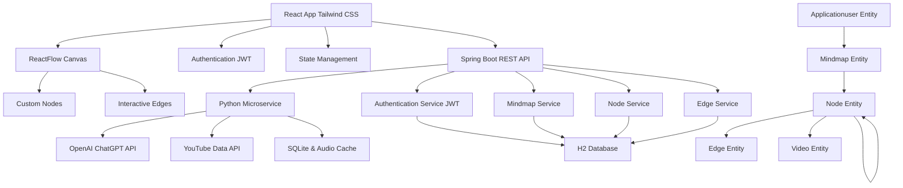
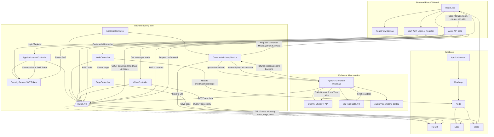
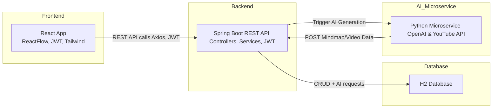
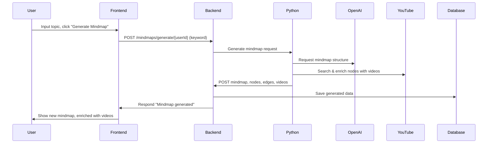
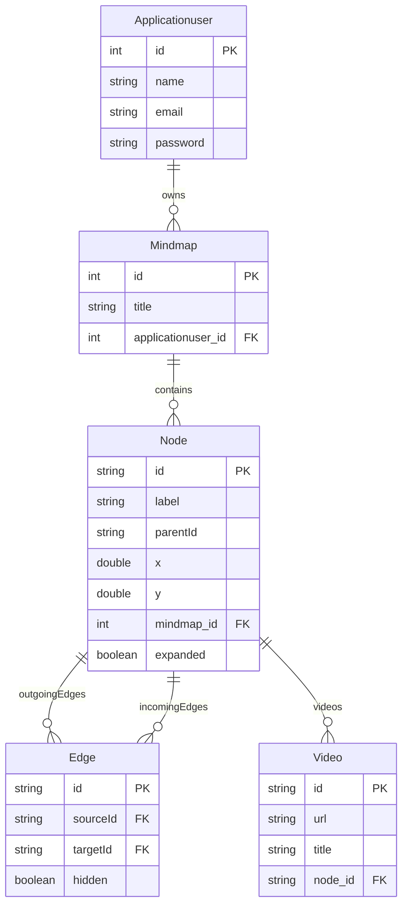

# MindmapApplication

## AI-Powered Mind Mapping Application

A professional, interactive mind mapping platform packed with advanced features—**AI-powered mind map generation (OpenAI ChatGPT API)**, **YouTube Data API video enrichment**, plus robust tools for manual mind map creation, drag-and-drop editing, search, user management, and security. The application is built with **React** (frontend), **Spring Boot (Java)** (REST API backend), and **Python** (AI and automation). Secure user authentication is managed with **JWT**.

---

## Project Overview

This platform enables users to generate, organize, and visualize mind maps enhanced by **artificial intelligence**—and also offers a manual editing and management tools. Users can automatically generate mind maps from a topic (using OpenAI ChatGPT API), manually build and edit maps, search and manage their own content, and explore related YouTube videos for every concept. All data and operations are protected by robust security and role-based access.

---

## Key Technologies & Integrations

- **Java Spring Boot REST API**: Robust backend exposing all data, authentication, and business logic endpoints.
- **JWT-Based Authentication**: Secure user session management and granular authorization.
- **Python Microservice**: Handles AI-powered mind map generation and video enrichment.
    - **OpenAI ChatGPT API**: For intelligent topic suggestion.
    - **YouTube Data API**: For fetching, and recommending videos per node.
- **React Frontend**: Modern UI and **ReactFlow** for mind map creation and editing.
- **Tailwind CSS**: For responsive, mobile-first design.

---

## Key Features

### AI-Powered Automatic Mind Map Generation
- **Input a keyword or topic** and instantly receive a structured mind map, automatically generated via **OpenAI ChatGPT API**.
- **Automatic video enrichment**: Each node is linked to relevant YouTube videos (via **YouTube Data API**) for deeper exploration.

#### Example
If a user enters `Machine Learning`:
- The system generates nodes like "Algorithms", "Data Preprocessing", "Model Evaluation", etc.
- Each node is automatically linked to curated YouTube videos.

---

### Manual Mind Map Creation & Editing
- **Create your own mind maps** from scratch—add, edit, and organize nodes and concepts.
- **Drag-and-drop interface**: Move nodes, restructure relationships, and connect ideas visually.
- **Dynamic node creation**: Add, edit, and position nodes.
- **Hierarchical structure**: Parent-child relationships with expand/collapse functionality.
- **Custom node types**: Specialized nodes for different content types.
- **Smart edge connections**: Automatic relationship detection and visual connections.

---

### Interactive Visual Interface
- **ReactFlow integration**: node-based editor.
- **Drag & drop**: Intuitive node positioning and rearrangement.
- **Zoom & pan**: Navigate large mind maps with smooth controls.
- **MiniMap**: Bird's-eye view for quick navigation.
- **Expand/collapse node hierarchy** for efficient navigation.
- **Real-time node and edge manipulation** with immediate visual feedback.

---

### Search, User Management & Security
- **Search functionality**: Instantly find mind maps by title or content.
- **User-specific mind maps**: Each user has their own private workspace; data is securely stored and isolated.
- **JWT authentication**: Secure sessions and data protection.
- **CRUD operations**: Full lifecycle management for mind maps, nodes, edges, and videos.

---

### Modern Web Technologies
- **Responsive design**: **Tailwind CSS**.
- **RESTful API**: Clean, documented endpoints for all operations.
- **Real-time updates**: Live synchronization of changes.
- **Cross-origin support**: Seamless frontend-backend communication.

---

## Architecture Principles

- **Component-based React design**.
- **Service layer pattern** (Spring Boot) for clean separation of business logic.
- **RESTful API** design for stateless, scalable backend.
- **Python microservice** for AI and video logic, connecting via API.
- **Entity relationship modeling** for normalized database design (Spring Data JPA).

---

## System Architecture

## MindmapApplication Architecture Diagram

### AI-powered mind map generation 

---

## Data Flow

1. **Manual mode**: Users build mind maps interactively in React; changes are persisted via REST API.
2. **AI mode**: Users input a topic; Spring Boot backend delegates to Python microservice.
3. Python service uses **OpenAI ChatGPT API** to generate mind map structure and **YouTube Data API** to find relevant videos.
4. Python service sends POST requests to backend to persist mind map, node, edge, and video data.
5. Frontend retrieves and displays the mind map for the authenticated user (**JWT authentication**).

---

## Technology Stack

### Frontend

| Technology      | Purpose                                    |
|-----------------|--------------------------------------------|
| **React**           | User interface, interactive editing      |
| **ReactFlow**       | Node-based mind map visualization        |
| React Router    | Routing                                    |
| **Tailwind CSS**    | Responsive design                       |
| Axios           | API communication                          |
| JWT Decode      | Token parsing/authentication               |
| React Icons     | Icon library                               |
| Heroicons       | SVG icons                                  |

### Backend

| Technology          | Purpose                                     |
|---------------------|---------------------------------------------|
| **Spring Boot (Java)**   | Backend framework, exposes REST API      |
| **Spring Security**      | JWT authentication, role-based access    |
| Spring Data JPA     | ORM/database abstraction                    |
| **H2 Database**         | Embedded relational DB                   |
| Jackson             | JSON serialization                          |
| Lombok              | Boilerplate reduction                       |

### AI & Python Integration

| Technology           | Purpose                                |
|----------------------|----------------------------------------|
| **Python**               | AI and microservices                 |
| **OpenAI ChatGPT API**   | Topic generation, NLP                |
| **YouTube Data API**     | Video search and metadata            |
| NetworkX             | Graph data structures                  |
| Plotly               | Visualization                          |
| yt-dlp               | YouTube audio download                 |
| sqlite3              | Local video/audio cache                |
| requests             | API communication with backend         |

---

## Domain Model Overview

- **Applicationuser**: Represents an authenticated user (id, name, email, password, mindmaps).
- **Mindmap**: Mind map entity (id, title, reference to Applicationuser, list of nodes).
- **Node**: Mind map element (id, label, parentId, x, y, reference to Mindmap, children, videos, expanded, edges).
- **Edge**: Link between nodes (id, source Node, target Node, hidden).
- **Video**: YouTube video (id, url, title, reference to Node).

---

## Entity Relationship Diagram

---

## Python-side SQLite Table Schema

- `mindmap_keyword_topic (sha256 TEXT, topic TEXT, url TEXT, UNIQUE(sha256, topic, url))` (**Python**, **YouTube Data API** integration)

---

## API Documentation (Spring Boot REST API)

### Mind Map Endpoints

| Method | Endpoint | Description |
|--------|----------|-------------|
| POST   | `/mindmaps/user/{userId}` | Create new mind map (**JWT required**) |
| GET    | `/mindmaps/user/{userId}` | Get user's mind maps (**JWT required**) |
| GET    | `/mindmaps/{id}`          | Get mind map by id (**JWT required**) |
| GET    | `/mindmaps/user/{userId}/search` | Search mind maps (**JWT required**) |
| PUT    | `/mindmaps/{id}`          | Update mind map (**JWT required**) |

### Node Management Endpoints

| Method | Endpoint | Description |
|--------|----------|-------------|
| POST   | `/mindmaps/mindmap/{mindmapId}/node` | Create new node (**JWT required**) |
| GET    | `/mindmaps/mindmap/{mindmapId}/node` | Get nodes for mind map (**JWT required**) |
| PUT    | `/node/{nodeId}`                     | Update node (**JWT required**) |
| DELETE | `/node/{nodeId}`                     | Delete node (**JWT required**) |

### Edge Management Endpoints

| Method | Endpoint | Description |
|--------|----------|-------------|
| POST   | `/mindmaps/edges/{sourceId}/{targetId}` | Create edge (**JWT required**) |
| GET    | `/nodes/{nodeId}/edges`                 | Get edges for node (**JWT required**) |
| PUT    | `/edges/{edgeId}`                       | Update edge (**JWT required**) |

### Video & AI Endpoints (**Python Microservice → Spring Boot REST API**)

| Method | Endpoint | Description |
|--------|----------|-------------|
| POST   | `/mindmaps/node/{nodeId}/video` | Add YouTube video to node |
| POST   | `/mindmaps/user/{userId}`       | Create mind map (from AI service) |
| POST   | `/mindmaps/mindmap/{mindmapId}/node` | Create node (from AI service) |
| POST   | `/mindmaps/edges/{sourceId}/{targetId}` | Create edge (from AI service) |

### Authentication Endpoints

| Method | Endpoint | Description      |
|--------|----------|------------------|
| POST   | `/auth/login`     | User authentication (**JWT issued**) |
| POST   | `/auth/register`  | User registration                    |
| GET    | `/auth/profile`   | Get user profile (**JWT required**)  |

---
